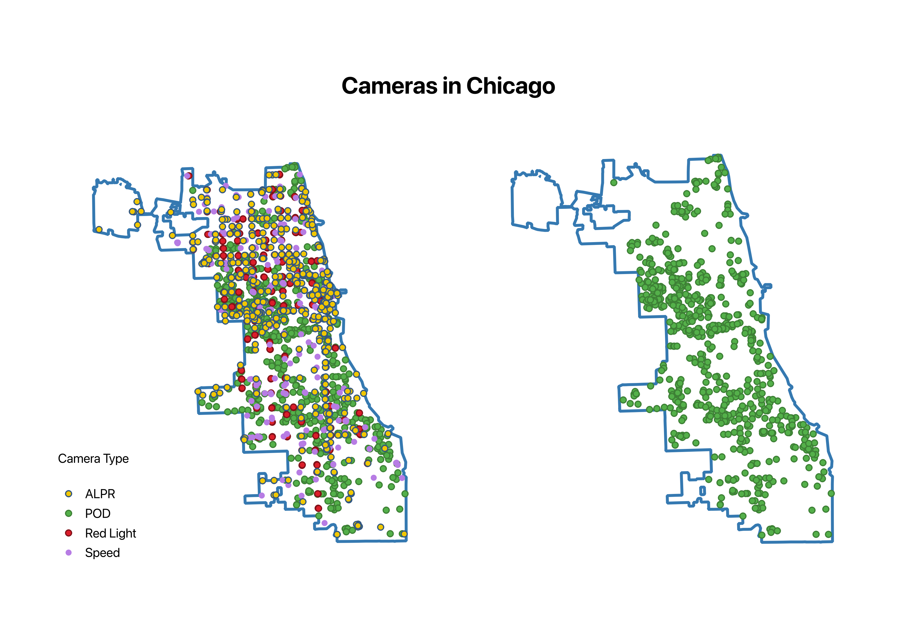
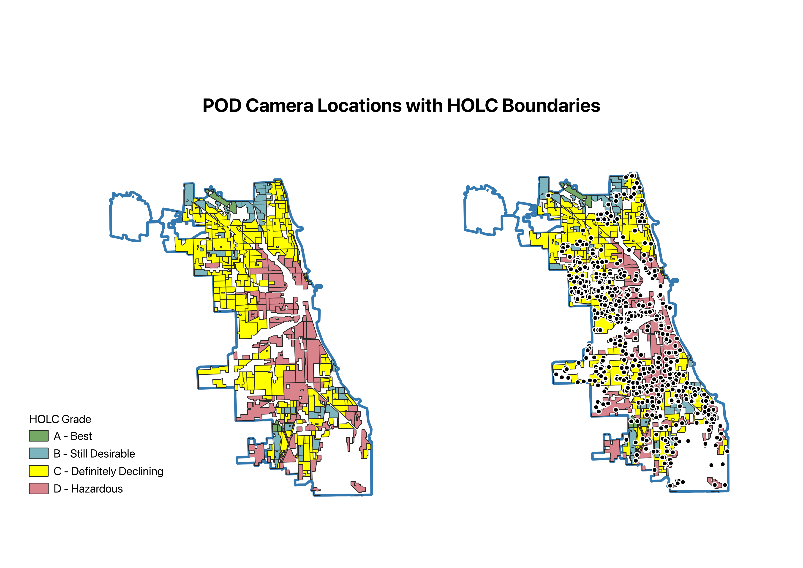
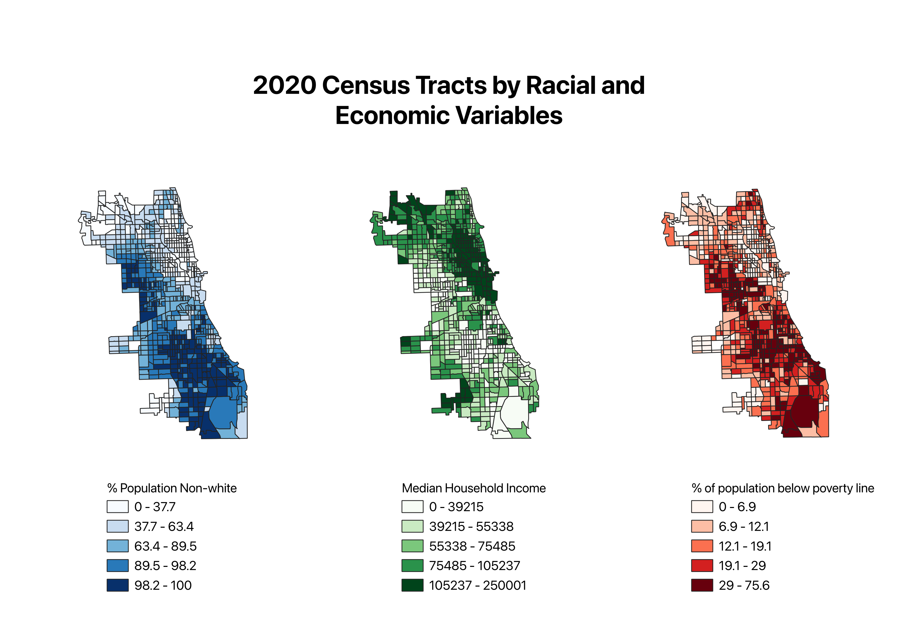

# Surveillance in the Shadow of Redlining
##### A Spatial Analysis of Chicago

```{r setup, include=FALSE}
knitr::opts_chunk$set(echo = TRUE, message = FALSE, warning = FALSE)
options(tigris_use_cache = TRUE)   # avoid re-downloading boundary files each render

suppressPackageStartupMessages({
  library(sf)
  library(dplyr)
  library(leaflet)
  library(tigris)
  library(tidycensus)
  library(spdep)
  library(terra)
  library(stars)
  library(gstat)
})
```

## Introduction

Chicago is home to one of the most extensive visual surveillance networks in the United States, from Police Observation Devices (PODs, colloquially known as blue-light cameras) to speed cameras and automated license plate readers (ALPRs). The true count of surveillance cameras within city bounds is not publicly known - most [estimates](https://www.technologyreview.com/2026/02/23/1132740/inside-chicago-surveillance-panopticon/) place the number well above 40,000 [1]. While surveillance infrastructure is often presented as a neutral safety technology, its placement is a spatial choice with social consequences.

Proponents of dragnet surveillance often argue that the locations chosen for camera installation is simply a response to localized crime rates, there is a growing body of [literature](https://www.jstor.org/stable/j.ctv11cw89p) that advocates for examining modern-day surveillance and policing as not solely a response to contemporary crime, but as the product of the historical economic, political, and social decision making by individuals and institutions that have shaped the networks we see today [2].

Chicago has a complicated relationship with neighborhood segregation and the historic practice of "redlining," institutionalized by the 1930s Home Owners Loan Corporation (HOLC). While the effects of HOLC redlining have been [well-studied](https://pmc.ncbi.nlm.nih.gov/articles/PMC12605564/) [3, 4], there exist fewer dedicated analyses of how it relates to surveillance technology. This project was started in the hope of developing a better understanding of how these concepts relate spatially, and if there is any meaningful relationship between the historic red and yellow-lined boundaries demarcated by HOLC and the placement of police cameras. In short, the question we'll be attempting to answer is:

> To what extent does the spatial distribution of contemporary surveillance infrastructure in Chicago reflect the geography of 1930s HOLC redlining, and how much of any observed relationship is explained by present-day demographic composition?

Many readers might see this question and ask: "why look historic boundaries as a possible explanation for surveillance camera placement and not crime? Wouldn't crime be an exogenous variable here?" That is a valid criticism if we were purely seeking to identify a causal relationship between redlining and camera placement; that's not quite our goal. Instead, we're aiming to uncover and describe potential relationships between the two in keeping with the idea surfaced above - that the surveillance and policing of marginalized communities is worth study on its own terms as a sociotechnical system shaped by history, politics, and contracts — rather than as a response to crime. 

## Data Sources

### American Community Survey Census Data

Census data and variables for race/ethnicity, median household income, poverty rate, and tract geography were obtained from the American Community Survey API.

### Home Owners Loan Corporation (HOLC) Polygons

The polygons for [HOLC boundaries](https://dsl.richmond.edu/panorama/redlining/data) - as well as the [crosswalk](https://github.com/americanpanorama/mapping-inequality-census-crosswalk/tree/main) [6] to both the 2010 and 2020 census tracts - was obtained from the ["Mapping Inequality: Redlining in New Deal America"](https://dsl.richmond.edu/panorama/redlining) project by Robert K. Nelson at the University of Richmond's Digital Scholarship Lab [5]. The data was provided in both GeoJSON and GPKG formats.

### Surveillance Camera Data

Location data for both [red light cameras](https://data.cityofchicago.org/d/thvf-6diy) [7] and [speed cameras](https://data.cityofchicago.org/d/4i42-qv3h) [8] were obtained from the Chicago Data Portal. The data was provided in tabular CSV format. POD camera data was parsed into GeoJSON from an [HTML file](https://github.com/lucyparsons/policesurveillance/blob/gh-pages/tactics/pod.html) located in a GitHub repo for the Police Surveillance project, a collaboration between RedShiftZero and the Lucy Parson's Lab that originally obtained POD location data via FOIA request to the city of Chicago [9]. Finally, the ALPR GeoJSON data was obtained from the [DeFlock](https://deflock.org/) website, who aggregated it from volunteer submissions [10]. It should be noted that crowdsourced data, by its nature, may be incomplete.

### Crime Data

Tabular [crime data](https://data.cityofchicago.org/d/ijzp-q8t2) was obtained from the Chicago Data Portal, and pulled in CSV format [11]. Note that this encompasses reported crime, and is not necessarily indicative of actual crime occurring. Reported crime can be a product of policing intensity, which is in itself a product of historical disinvestment.

## Methodology

To answer our research question, we follow this general outline:

1. Visualize historical HOLC boundaries with a POD camera overlay.
2. Crosswalk the HOLC polygons to 2020 census tracts and assign HOLC grades to current geographies.
3. Generate raster map of surveillance reach to identify areas of high camera concentration.
4. Compare the raster map to choropleths of relevant ACS demographic variables
5. Run a univariate LISA on HOLC-graded 2020 census tracts to identify persistent clustering
6. Determine if hot/cold spots from Local Moran's I overlap or share geographic space.

### Units of Analysis and Definitions

This project will operate using census tracts as the primary unit for analysis largely for ease of use, but also for a finer-grain look at the spatial data and as a measure to avoid patterns being obscured by the modifiable areal unit problem. Census tracts are where ACS estimates are immediately reliable, and where the HOLC crosswalk operates. This elimates the need for additional interpolation.

For the purposes of this project, we'll also be primarily looking at POD cameras for a few reasons. The first is that POD camera installation generally attracts the most attention interest from the media and communities in which they are installed - largely due to their advanced pan-tilt-zoom and 360-degree rotation capabilities. The second (and perhaps more salient) reason is simplicity. POD Cameras are owned and operated by a single entity - the Chicago Police Department. While individual aldermen do make decisions about camera installations in their jurisdictions, we believe that analyzing a subset of cameras with fewer orgnizational owners provides a clearer image of potential spatial patterns that may arise during mapping. Peforming our analysis with fewer data points also makes the task of interpreting results more manageable.

### Study Area

The area of analysis will be limited to the city of Chicago, rather than to Cook County more broadly.

```{r chicago-bounds-map, message=FALSE, warning=FALSE}
chicago_bounds <- suppressMessages(tigris::places(state = "IL", cb = TRUE, progress_bar = FALSE)) |>
  filter(NAME == "Chicago") |>
  st_transform(4326)

leaflet(chicago_bounds) |>
  addProviderTiles(providers$CartoDB.Positron) |>
  addPolygons(
    fill   = FALSE,
    color  = "#222222",
    weight = 2,
    opacity = 0.9
  )
```

### Data Preparation

As a way of providing more information about individual cameras within the interactive maps, reverse geocoding was used to assign street/address labels to POD cameras from the latitude and longitude values. We also take care to remvove cameras with missing coordinates and those that fall outside the city bounds of Chicago. Many camera points in the data set are located within Cook County, but not within Chicago itself.

### Tools Used

Alongside a number of R packages used for mapping, packaging, and geospatial analysis (sf, leaflet, tigris, terra, etc,) we also used Q-GIS to create many of the maps displayed in this project report - alongside a one-off JavaScript snippet that was created to scrape POD camera data from an HTML file.

## Mapping Surveillance Cameras in Chicago

First, let's consolidate all four camera datasets — PODs, red light cameras, speed cameras, and ALPRs — into a single GeoPackage. Each point is tagged with a `type` column, and the Chicago city boundary is included as a second layer. As a note, we'll filter cameras down to being within Chicago boundaries.


```{r build-camera-gpkg, message=FALSE, warning=FALSE}

# Chicago boundary in EPSG:3435 (NAD83 / Illinois East, ftUS) — all analysis stays projected
chicago_bounds <- suppressMessages(tigris::places(state = "IL", cb = TRUE, progress_bar = FALSE)) |>
  filter(NAME == "Chicago") |>
  st_transform(3435) |>
  transmute(name = NAME)

# Normalize each source to a common (type, details, geometry) schema.
# Apply the Chicago clip to ALL sources — even Chicago Data Portal feeds occasionally
# include retired or just-outside-the-line entries. CSV sources are assigned EPSG:4326
# (lat/lon) on read, then projected to 3435 before any spatial operation.
clip_chicago <- function(x, label) {
  before <- nrow(x)
  out    <- st_filter(x, chicago_bounds)
  cat(sprintf("%-10s kept %d of %d (%d dropped)\n",
              label, nrow(out), before, before - nrow(out)))
  out
}

pod_cameras <- st_read("data/pod_cameras.geojson", quiet = TRUE) |>
  st_transform(3435) |>
  clip_chicago("POD") |>
  transmute(type = "POD",
            details = paste0("Camera #", camera_number, " — ", street))

redlights <- read.csv("data/redlights.csv") |>
  st_as_sf(coords = c("LONGITUDE", "LATITUDE"), crs = 4326) |>
  st_transform(3435) |>
  clip_chicago("Red Light") |>
  transmute(type = "Red Light", details = INTERSECTION)

speed_cameras <- read.csv("data/speed_cameras.csv") |>
  st_as_sf(coords = c("LONGITUDE", "LATITUDE"), crs = 4326) |>
  st_transform(3435) |>
  clip_chicago("Speed") |>
  transmute(type = "Speed", details = ADDRESS)

alpr <- st_read("data/cameras.geojson.gz", quiet = TRUE) |>
  st_transform(3435) |>
  clip_chicago("ALPR") |>
  transmute(type = "ALPR", details = coalesce(operator, "Unknown"))

all_cameras <- bind_rows(pod_cameras, redlights, speed_cameras, alpr)

# Write multi-layer GPKG — data is already in EPSG:3435
dir.create("output", showWarnings = FALSE)
gpkg_path <- "output/chicago_surveillance.gpkg"

st_write(all_cameras,    gpkg_path, layer = "cameras",          delete_dsn = TRUE, quiet = TRUE)
st_write(chicago_bounds, gpkg_path, layer = "chicago_boundary", append = TRUE,     quiet = TRUE)

cat("Wrote", nrow(all_cameras), "cameras to", gpkg_path, "\n")
print(table(all_cameras$type))
```

#### Camera Locations in Chicago

When taken as a whole, the cameras in our dataset look to be evenly distributed across the city.



While this already gives us an idea of how extensive the surveillance network is, different sets of cameras are owned by administratively distinct entities within the city and may serve different purposes. For reasons described within [the methodology section](#methodology) we'll limit ourselves to just POD cameras for mapping and analysis moving forward.

## HOLC Mapping and Descriptive Analysis

To pair the HOLC redlining polygons with the camera layer in QGIS, we export them to a dedicated GeoPackage, clipped to modern Chicago city limits so they align cleanly with our other layers. Polygons graded A–D are retained; the small set of ungraded "Commercial" / "Industrial" areas in the source data is dropped.

```{r build-holc-gpkg, message=FALSE, warning=FALSE}
# Re-derive Chicago boundary in EPSG:3435 so this chunk stands alone and all
# spatial operations below run in the projected CRS.
chicago_bounds <- suppressMessages(tigris::places(state = "IL", cb = TRUE, progress_bar = FALSE)) |>
  filter(NAME == "Chicago") |>
  st_transform(3435) |>
  transmute(name = NAME)

# Load HOLC polygons → project to 3435 → filter to Chicago, IL → clean grades → clip
chicago_holc <- st_read("data/mappinginequality.json", quiet = TRUE) |>
  st_transform(3435) |>
  filter(city == "Chicago", state == "IL") |>
  mutate(grade = trimws(grade)) |>                       # strip stray whitespace ("A ", "C ")
  filter(grade %in% c("A", "B", "C", "D")) |>            # drop Commercial / Industrial (ungraded)
  st_make_valid() |>
  st_intersection(chicago_bounds) |>
  filter(st_geometry_type(geometry) %in% c("POLYGON", "MULTIPOLYGON")) |>
  select(area_id, grade, category, label, fill)

# Load POD cameras → project to 3435 → clip to Chicago bounds
pod_cameras <- st_read("data/pod_cameras.geojson", quiet = TRUE) |>
  st_transform(3435) |>
  st_filter(chicago_bounds) |>
  transmute(camera_number, street, zip)

# Write multi-layer GPKG — data is already in EPSG:3435
dir.create("output", showWarnings = FALSE)
holc_gpkg_path <- "output/chicago_holc.gpkg"

st_write(chicago_holc,   holc_gpkg_path, layer = "holc_polygons",    delete_dsn = TRUE, quiet = TRUE)
st_write(pod_cameras,    holc_gpkg_path, layer = "pod_cameras",      append = TRUE,     quiet = TRUE)
st_write(chicago_bounds, holc_gpkg_path, layer = "chicago_boundary", append = TRUE,     quiet = TRUE)

cat("Wrote", nrow(chicago_holc), "HOLC polygons and",
    nrow(pod_cameras), "POD cameras to", holc_gpkg_path, "\n")
print(table(chicago_holc$grade))
```



We can already see an interesting visual relationship between camera location and the historical HOLC boundaries classified as "Definitely Declining" or "Hazardous." To quantify what the map suggests visually, we summarize POD camera counts and density by HOLC grade. Both raw shares and area-normalized densities (cameras per square mile) are reported so that differences in the total area covered by each grade don't obscure the underlying intensity.

```{r camera-density-by-grade, message=FALSE, warning=FALSE}
density_by_grade <- chicago_holc |>
  st_make_valid() |>
  mutate(n_cameras = lengths(st_intersects(geometry, pod_cameras))) |>
  mutate(area_mi2 = as.numeric(st_area(geometry)) / 2589988.11) |>    # geometry is already in EPSG:3435 (ftUS)
  st_drop_geometry() |>
  group_by(grade, category) |>
  summarise(
    n_polygons      = n(),
    n_cameras       = sum(n_cameras),
    area_mi2        = sum(area_mi2),
    cameras_per_mi2 = n_cameras / area_mi2,
    .groups = "drop"
  ) |>
  mutate(share_pct = n_cameras / sum(n_cameras) * 100) |>
  arrange(grade)

knitr::kable(
  density_by_grade,
  digits    = 2,
  col.names = c("Grade", "Category", "Polygons", "Cameras", "Area (mi²)", "Cameras / mi²", "Share (%)"),
  caption   = "POD camera density by HOLC grade (within modern Chicago bounds)"
)
```

We find that camera density per square mile is highest in the historical grades C and D polygons. In fact, polygons of those classifications contain around 95% of POD cameras that fall within any HOLC boundary - despite grade C and D having a combined 87% of the land share. This is interesting, but we'll want to take it a step further by bridging HOLC boundaries to a more current geography.

### Crosswalking to Modern Census Tracts

To bridge the 1930s HOLC geography with present-day analyses, we crosswalk HOLC grades onto modern (2020) census tracts. For each Chicago tract we compute the share of its area that falls within each HOLC grade, and assign a single **modal grade** — the grade covering the largest share of the tract. The full share vector is retained too, so tracts that straddle multiple grades aren't forced into a binary classification.

```{r holc-tract-crosswalk, message=FALSE, warning=FALSE}
holc_gpkg_path <- "output/chicago_holc.gpkg"

# Pull 2020 Cook County tracts and prepare in EPSG:3435
cook_tracts <- suppressMessages(tigris::tracts(state = "IL", county = "031", year = 2020, cb = TRUE, progress_bar = FALSE))
cook_tracts <- st_transform(cook_tracts, 3435)
cook_tracts <- st_filter(cook_tracts, chicago_bounds)
cook_tracts <- st_make_valid(cook_tracts)

# Intersect tracts with HOLC polygons; record area of each piece in mi²
tract_pieces <- st_intersection(cook_tracts, chicago_holc)
tract_pieces$piece_area_mi2 <- as.numeric(st_area(tract_pieces)) / 2589988.11
tract_holc <- st_drop_geometry(tract_pieces)

# Total area per tract (denominator for shares)
tract_areas <- data.frame(GEOID = cook_tracts$GEOID, total_area_mi2 = as.numeric(st_area(cook_tracts)) / 2589988.11)

# Sum piece area per (tract, grade); attach total to compute share
grade_area <- aggregate(piece_area_mi2 ~ GEOID + grade, data = tract_holc, FUN = sum)
grade_area <- merge(grade_area, tract_areas, by = "GEOID")
grade_area$share <- grade_area$piece_area_mi2 / grade_area$total_area_mi2

# Pivot long → wide via base reshape (one column per grade share)
grade_shares <- reshape(grade_area[, c("GEOID", "grade", "share")], idvar = "GEOID", timevar = "grade", direction = "wide")
names(grade_shares) <- sub("share\\.", "share_", names(grade_shares))

# Modal (largest-area) grade per tract — sort then keep first per GEOID
ord <- order(grade_area$GEOID, -grade_area$piece_area_mi2)
grade_area_sorted <- grade_area[ord, ]
modal_grade <- grade_area_sorted[!duplicated(grade_area_sorted$GEOID), c("GEOID", "grade")]
names(modal_grade)[2] <- "modal_grade"

# Join shares + modal grade back to tract geometry
holc_tracts <- left_join(cook_tracts, grade_shares, by = "GEOID")
holc_tracts <- left_join(holc_tracts, modal_grade, by = "GEOID")

# Append to the HOLC GPKG (data is already in EPSG:3435)
st_write(holc_tracts, holc_gpkg_path, layer = "holc_tracts", append = TRUE, quiet = TRUE)

# Summary: how many tracts fall into each modal grade?
modal_tbl <- table(holc_tracts$modal_grade, useNA = "ifany")
modal_summary <- as.data.frame(modal_tbl)
names(modal_summary) <- c("Modal HOLC Grade", "Tracts")
caption_txt <- "Chicago census tracts (2020) by majority historical HOLC grade"
knitr::kable(modal_summary, caption = caption_txt)
```

```{r holc-tracts-map, message=FALSE, warning=FALSE}
# Canonical HOLC palette, with gray for tracts that have no historical HOLC overlay
grade_pal <- colorFactor(
  palette = c("#76a865", "#7cb5bd", "#ffff00", "#d9838d"),
  levels  = c("A", "B", "C", "D"),
  na.color = "#cccccc"
)

tract_popup <- paste0(
  "<b>Tract ", holc_tracts$GEOID, "</b><br>",
  "Modal grade: ", ifelse(is.na(holc_tracts$modal_grade), "—", holc_tracts$modal_grade), "<br>",
  "Share A: ", scales::percent(holc_tracts$share_A, accuracy = 1), "<br>",
  "Share B: ", scales::percent(holc_tracts$share_B, accuracy = 1), "<br>",
  "Share C: ", scales::percent(holc_tracts$share_C, accuracy = 1), "<br>",
  "Share D: ", scales::percent(holc_tracts$share_D, accuracy = 1)
)

pod_cameras_wgs <- st_transform(pod_cameras, 4326)
pod_label <- paste("POD Camera #", pod_cameras_wgs$camera_number)

leaflet(st_transform(holc_tracts, 4326)) |>             # leaflet requires WGS84 for tile alignment
  addProviderTiles(providers$CartoDB.Positron) |>
  addPolygons(
    fillColor   = ~grade_pal(modal_grade),
    fillOpacity = 0.7,
    color       = "white", weight = 0.5,
    popup       = tract_popup,
    label       = ~paste0("Tract ", GEOID, " — ", ifelse(is.na(modal_grade), "no HOLC overlay", modal_grade)),
    group       = "Modal HOLC Grade"
  ) |>
  addCircleMarkers(
    data        = pod_cameras_wgs,
    radius      = 3,
    color       = "white",
    stroke      = TRUE, weight = 1,
    fillColor   = "#000000", fillOpacity = 1,
    label       = pod_label,
    group       = "POD Cameras"
  ) |>
  addLayersControl(
    overlayGroups = c("Modal HOLC Grade", "POD Cameras"),
    options = layersControlOptions(collapsed = FALSE)
  ) |>
  addLegend(
    position = "bottomright",
    colors   = c("#76a865", "#7cb5bd", "#ffff00", "#d9838d", "#cccccc"),
    labels   = c("A — Best", "B — Still Desirable", "C — Definitely Declining", "D — Hazardous", "No HOLC overlay"),
    title    = "Modal HOLC Grade<br>(2020 tracts)"
  )
```

Interestingly, this map visually suggests that in contemporary times POD camera location seems to be more clustered in tracts that are classified with the historic C grade rather than conforming solely to the historic red-line boundaries.

### Modern Demographic Context

We'll want to explore possible explanations for why our visual analysis to this point has not quite aligned with our expectations - and accomplish this by examining the present-day demography. Three core ACS variables will be pulled for every 2020 Chicago tract and exported to a GeoPackage suitable for choropleth mapping in QGIS:

- **Percent non-white** — derived from `B03002` (Hispanic or Latino origin by race), as `1 − white_alone_non_Hispanic / total_population`.
- **Median household income** — `B19013_001`.
- **Poverty rate** — `B17001_002 / B17001_001`, the share of the population for whom poverty status was determined that fell below the federal poverty line.

These three variables were chosen due to their established presence in [research and literature](https://5harad.com/papers/surveillance-and-diversity.pdf) and well-studied correlation with surveillance intensity [12].

```{r census-variable-export, message=FALSE, warning=FALSE}
# Load Census API key from project-local .Renviron (mirrors the test.qmd pattern)
if (file.exists(".Renviron")) readRenviron(".Renviron")
census_api_key(Sys.getenv("CENSUS_API_KEY"), install = FALSE, overwrite = FALSE)

# Chicago boundary (clip mask + stand-alone layer), projected to EPSG:3435 for analysis
chicago_bounds <- suppressMessages(tigris::places(state = "IL", cb = TRUE, progress_bar = FALSE)) |>
  filter(NAME == "Chicago") |>
  st_transform(3435) |>
  transmute(name = NAME)

# ACS variable codes (named so we can reference them as columns)
acs_vars <- c(
  total_pop        = "B03002_001",   # Total population
  white_nh_pop     = "B03002_003",   # White alone, not Hispanic or Latino
  median_hh_income = "B19013_001",   # Median household income
  poverty_universe = "B17001_001",   # Population for whom poverty status determined
  poverty_below    = "B17001_002"    # Population below poverty line
)

# 2018-2022 ACS 5-year — latest aligned with 2020 tracts
acs_wide <- get_acs(geography = "tract", variables = acs_vars, state = "IL", county = "031", year = 2022, geometry = FALSE, output = "wide")
acs_data <- data.frame(GEOID = acs_wide$GEOID)
acs_data$pct_nonwhite <- (1 - acs_wide$white_nh_popE / acs_wide$total_popE) * 100
acs_data$median_income <- acs_wide$median_hh_incomeE
acs_data$poverty_rate <- (acs_wide$poverty_belowE / acs_wide$poverty_universeE) * 100

# Pull all 2020 Cook County tracts in EPSG:3435
cook_tracts_all <- suppressMessages(tigris::tracts(state = "IL", county = "031", year = 2020, cb = TRUE, progress_bar = FALSE))
cook_tracts_all <- st_transform(cook_tracts_all, 3435)
cook_tracts_all <- st_make_valid(cook_tracts_all)

# For each tract, compute the share of its area that falls inside Chicago bounds
tract_in_chi <- st_intersection(cook_tracts_all, chicago_bounds)
tract_in_chi$piece_area <- as.numeric(st_area(tract_in_chi))
in_chi_long <- st_drop_geometry(tract_in_chi)
in_chi_area <- aggregate(piece_area ~ GEOID, data = in_chi_long, FUN = sum)

# Build overlap table: GEOID + total tract area + area inside Chicago + share
total_area <- as.numeric(st_area(cook_tracts_all))
overlap <- data.frame(GEOID = cook_tracts_all$GEOID, total_area = total_area)
overlap <- merge(overlap, in_chi_area, by = "GEOID", all.x = TRUE)
overlap$share_in_chi <- overlap$piece_area / overlap$total_area
overlap$share_in_chi[is.na(overlap$share_in_chi)] <- 0

# Keep only tracts with at least 50% of their area inside Chicago
keep_geoids <- overlap$GEOID[overlap$share_in_chi >= 0.5]
keep_mask <- cook_tracts_all$GEOID %in% keep_geoids
chi_tracts_acs <- cook_tracts_all[keep_mask, ]
chi_tracts_acs <- chi_tracts_acs[, c("GEOID", "NAME")]
chi_tracts_acs <- left_join(chi_tracts_acs, acs_data, by = "GEOID")

cat("Kept", nrow(chi_tracts_acs), "of", nrow(cook_tracts_all), "Cook County tracts (>=50% Chicago overlap)\n")

# Write two-layer GPKG — data is already in EPSG:3435
dir.create("output", showWarnings = FALSE)
census_gpkg_path <- "output/chicago_census_tracts.gpkg"

st_write(chi_tracts_acs, census_gpkg_path, layer = "tracts_acs", delete_dsn = TRUE, quiet = TRUE)
st_write(chicago_bounds, census_gpkg_path, layer = "chicago_boundary", append = TRUE, quiet = TRUE)

cat("Wrote", nrow(chi_tracts_acs), "Chicago tracts with ACS variables to", census_gpkg_path, "\n")
```



## Surveillance and Redlining

We now bring the camera and HOLC layers together at the tract level. For each 2020 Chicago tract we count the POD cameras that fall inside it and divide by the tract's area in square miles to get a directly comparable density. Those tract-level metrics are exported to a GeoPackage so the choropleth can be authored in QGIS, and aggregated to the four modal HOLC grades for the summary table below.

```{r build-camera-density-gpkg, message=FALSE, warning=FALSE}
# Filter tracts to at least 50% overlap with Chicago bounds (same rule as census GPKG)
holc_total_area <- as.numeric(st_area(holc_tracts))
holc_in_chi <- st_intersection(holc_tracts, chicago_bounds)
holc_in_chi$piece_area <- as.numeric(st_area(holc_in_chi))
holc_in_chi_long <- st_drop_geometry(holc_in_chi)
holc_in_chi_area <- aggregate(piece_area ~ GEOID, data = holc_in_chi_long, FUN = sum)

holc_overlap <- data.frame(GEOID = holc_tracts$GEOID, total_area = holc_total_area)
holc_overlap <- merge(holc_overlap, holc_in_chi_area, by = "GEOID", all.x = TRUE)
holc_overlap$share_in_chi <- holc_overlap$piece_area / holc_overlap$total_area
holc_overlap$share_in_chi[is.na(holc_overlap$share_in_chi)] <- 0

keep_holc <- holc_overlap$GEOID[holc_overlap$share_in_chi >= 0.5]
holc_keep_mask <- holc_tracts$GEOID %in% keep_holc
holc_tracts <- holc_tracts[holc_keep_mask, ]

cat("Kept", nrow(holc_tracts), "tracts with at least 50% Chicago overlap\n")

# Two metrics:
#   _inside = traditional point-in-polygon (camera physically sits in the tract)
#   _reach  = camera's quarter-mile buffer (1320 ft) intersects the tract; a camera
#             near a boundary contributes to every tract within its reach
pod_buffers <- st_buffer(pod_cameras, dist = 1320)

holc_tracts$n_cameras_inside <- lengths(st_intersects(holc_tracts, pod_cameras))
holc_tracts$n_cameras_reach <- lengths(st_intersects(holc_tracts, pod_buffers))
holc_tracts$tract_area_mi2 <- as.numeric(st_area(holc_tracts)) / 2589988.11
holc_tracts$inside_per_mi2 <- holc_tracts$n_cameras_inside / holc_tracts$tract_area_mi2
holc_tracts$reach_per_mi2 <- holc_tracts$n_cameras_reach / holc_tracts$tract_area_mi2

# Write tract-level camera density to its own GPKG for QGIS choropleth use
dir.create("output", showWarnings = FALSE)
density_gpkg_path <- "output/chicago_camera_density.gpkg"

st_write(holc_tracts, density_gpkg_path, layer = "tract_camera_density", delete_dsn = TRUE, quiet = TRUE)
st_write(chicago_bounds, density_gpkg_path, layer = "chicago_boundary", append = TRUE, quiet = TRUE)

cat("Wrote", nrow(holc_tracts), "tracts to", density_gpkg_path, "\n")
```

```{r holc-camera-density-table, message=FALSE, warning=FALSE}
# Summarize camera distribution by modal HOLC grade (drop NA-grade tracts)
summary_df <- st_drop_geometry(holc_tracts)
summary_df <- summary_df[!is.na(summary_df$modal_grade), ]

n_tracts <- aggregate(GEOID ~ modal_grade, data = summary_df, FUN = length)
names(n_tracts)[2] <- "n_tracts"

inside_sum <- aggregate(n_cameras_inside ~ modal_grade, data = summary_df, FUN = sum)
names(inside_sum)[2] <- "inside_total"

reach_sum <- aggregate(n_cameras_reach ~ modal_grade, data = summary_df, FUN = sum)
names(reach_sum)[2] <- "reach_total"

total_area <- aggregate(tract_area_mi2 ~ modal_grade, data = summary_df, FUN = sum)
names(total_area)[2] <- "area_mi2"

summary_table <- merge(n_tracts, inside_sum, by = "modal_grade")
summary_table <- merge(summary_table, reach_sum, by = "modal_grade")
summary_table <- merge(summary_table, total_area, by = "modal_grade")
summary_table$inside_per_mi2 <- summary_table$inside_total / summary_table$area_mi2
summary_table$reach_per_mi2 <- summary_table$reach_total / summary_table$area_mi2
summary_table$share_inside_pct <- summary_table$inside_total / sum(summary_table$inside_total) * 100

grade_categories <- c(A = "Best", B = "Still Desirable", C = "Definitely Declining", D = "Hazardous")
summary_table$category <- grade_categories[as.character(summary_table$modal_grade)]

summary_table <- summary_table[order(summary_table$modal_grade), ]
summary_table <- summary_table[, c("modal_grade", "category", "n_tracts", "inside_total", "reach_total", "area_mi2", "inside_per_mi2", "reach_per_mi2", "share_inside_pct")]

caption_txt <- "POD camera distribution by modal HOLC grade (Chicago 2020 tracts)"
col_names <- c("Grade", "Category", "Tracts", "Cameras (inside)", "Cameras (1/4 mi reach)", "Area (mi2)", "Inside / mi2", "Reach / mi2", "Share Inside (%)")
knitr::kable(summary_table, digits = 2, col.names = col_names, caption = caption_txt)
```

### Camera Distribution by Poverty Quintile

The HOLC cross-tab uses a historical grade; here we slice cameras by a present-day equity measure. We rank Chicago tracts by ACS poverty rate into five **equal-tract quintiles** (each holding ~20% of tracts) and report the share of all POD cameras that physically sit inside the tracts in each quintile. ACS estimates are reported at the tract level, so treating each tract as one unit avoids letting tract-size variation distort the quintile breaks.

```{r poverty-quintile-cameras, message=FALSE, warning=FALSE}
# Pull total population once for per-quintile population totals; reused by the
# non-white and income quintile chunks below.
total_pop_pull <- get_acs(
  geography = "tract",
  variables = c(total_pop = "B01003_001"),
  state = "IL", county = "031", year = 2022,
  geometry = FALSE
)
total_pop_df <- data.frame(GEOID = total_pop_pull$GEOID, total_pop = total_pop_pull$estimate)

# Camera count per Chicago tract (point-in-polygon). chi_tracts_acs and pod_cameras
# are both EPSG:3435, so st_intersects runs in the projected CRS.
pov_tracts <- chi_tracts_acs
pov_tracts$n_cameras <- lengths(st_intersects(pov_tracts, pod_cameras))
pov_tracts <- left_join(pov_tracts, total_pop_df, by = "GEOID")
pov_tracts <- pov_tracts[!is.na(pov_tracts$poverty_rate), ]

# Equal-tract quintiles: each bin holds ~20% of tracts, ranked by poverty rate
pov_tracts$pov_quintile <- factor(
  ntile(pov_tracts$poverty_rate, 5),
  levels = 1:5,
  labels = c("Q1 (lowest poverty)", "Q2", "Q3", "Q4", "Q5 (highest poverty)")
)

quintile_summary <- st_drop_geometry(pov_tracts) |>
  group_by(pov_quintile) |>
  summarise(
    tracts       = n(),
    population   = sum(total_pop, na.rm = TRUE),
    cameras      = sum(n_cameras),
    pov_rate_min = min(poverty_rate),
    pov_rate_max = max(poverty_rate),
    .groups = "drop"
  ) |>
  mutate(
    share_pop_pct     = population / sum(population) * 100,
    share_cameras_pct = cameras    / sum(cameras)    * 100
  )

knitr::kable(
  quintile_summary,
  digits    = 2,
  col.names = c("Quintile", "Tracts", "Population", "Cameras",
                "Pov rate min (%)", "Pov rate max (%)",
                "Share pop (%)", "Share cameras (%)"),
  caption   = "POD cameras by equal-tract poverty-rate quintile (Chicago, 2018-2022 ACS)"
)
```

### Camera Distribution by Non-White Share Quintile

Same equal-tract quintile structure for racial composition: tracts are ranked by their percent non-white (from `B03002`) into five bins of ~20% of tracts each. Q5 is the fifth of tracts with the highest non-white share.

```{r nonwhite-quintile-cameras, message=FALSE, warning=FALSE}
# Reuses total_pop_df from the poverty chunk above
nw_tracts <- chi_tracts_acs
nw_tracts$n_cameras <- lengths(st_intersects(nw_tracts, pod_cameras))
nw_tracts <- left_join(nw_tracts, total_pop_df, by = "GEOID")
nw_tracts <- nw_tracts[!is.na(nw_tracts$pct_nonwhite), ]

nw_tracts$nw_quintile <- factor(
  ntile(nw_tracts$pct_nonwhite, 5),
  levels = 1:5,
  labels = c("Q1 (lowest % non-white)", "Q2", "Q3", "Q4", "Q5 (highest % non-white)")
)

nw_quintile_summary <- st_drop_geometry(nw_tracts) |>
  group_by(nw_quintile) |>
  summarise(
    tracts           = n(),
    population       = sum(total_pop, na.rm = TRUE),
    cameras          = sum(n_cameras),
    pct_nonwhite_min = min(pct_nonwhite),
    pct_nonwhite_max = max(pct_nonwhite),
    .groups = "drop"
  ) |>
  mutate(
    share_pop_pct     = population / sum(population) * 100,
    share_cameras_pct = cameras    / sum(cameras)    * 100
  )

knitr::kable(
  nw_quintile_summary,
  digits    = 2,
  col.names = c("Quintile", "Tracts", "Population", "Cameras",
                "% non-white min", "% non-white max",
                "Share pop (%)", "Share cameras (%)"),
  caption   = "POD cameras by equal-tract non-white share quintile (Chicago, 2018-2022 ACS)"
)
```

### Camera Distribution by Median Household Income Quintile

Same equal-tract quintile structure for median household income (`B19013`). Q1 is the fifth of tracts with the lowest median income — the inverse polarity of the poverty table, so we expect Q1 here to look roughly like Q5 of the poverty table if economic disinvestment and surveillance track together.

```{r income-quintile-cameras, message=FALSE, warning=FALSE}
# Reuses total_pop_df from the poverty chunk above
inc_tracts <- chi_tracts_acs
inc_tracts$n_cameras <- lengths(st_intersects(inc_tracts, pod_cameras))
inc_tracts <- left_join(inc_tracts, total_pop_df, by = "GEOID")
inc_tracts <- inc_tracts[!is.na(inc_tracts$median_income), ]

inc_tracts$inc_quintile <- factor(
  ntile(inc_tracts$median_income, 5),
  levels = 1:5,
  labels = c("Q1 (lowest income)", "Q2", "Q3", "Q4", "Q5 (highest income)")
)

inc_quintile_summary <- st_drop_geometry(inc_tracts) |>
  group_by(inc_quintile) |>
  summarise(
    tracts     = n(),
    population = sum(total_pop, na.rm = TRUE),
    cameras    = sum(n_cameras),
    income_min = min(median_income),
    income_max = max(median_income),
    .groups = "drop"
  ) |>
  mutate(
    share_pop_pct     = population / sum(population) * 100,
    share_cameras_pct = cameras    / sum(cameras)    * 100
  )

# Pre-format income columns so they render as integer dollar values rather than
# inheriting the share columns' decimal precision in knitr::kable
inc_quintile_summary$income_min <- formatC(inc_quintile_summary$income_min, format = "d", big.mark = ",")
inc_quintile_summary$income_max <- formatC(inc_quintile_summary$income_max, format = "d", big.mark = ",")

knitr::kable(
  inc_quintile_summary,
  digits    = 2,
  col.names = c("Quintile", "Tracts", "Population", "Cameras",
                "Median income min ($)", "Median income max ($)",
                "Share pop (%)", "Share cameras (%)"),
  caption   = "POD cameras by equal-tract median household income quintile (Chicago, 2018-2022 ACS)"
)
```

### Kriging Surveillance Reach

The tract-level reach density gives a discrete view of surveillance intensity, but tract boundaries are arbitrary administrative units, not real surveillance edges. To produce a smoother continuous estimate of surveillance reach across Chicago, we treat each tract centroid as a point measurement of `reach_per_mi2` and run ordinary kriging onto a 1000-foot grid. The fitted variogram captures how spatial autocorrelation in surveillance reach decays with distance, and the kriging prediction surface gives an interpolated value at every grid cell, with a companion uncertainty raster.

```{r kriging-prep, message=FALSE, warning=FALSE, progress=FALSE}
# Point measurements: tract centroids carry the reach_per_mi2 value.
# Strip to just the modeled column + geometry so gstat's sf->sp conversion
# (which calls sp::addAttrToGeom) doesn't trip on inherited tigris columns.
tract_centroids <- st_centroid(holc_tracts)
tract_centroids <- tract_centroids[!is.na(tract_centroids$reach_per_mi2), "reach_per_mi2"]
tract_centroids$reach_per_mi2 <- as.numeric(tract_centroids$reach_per_mi2)
tract_centroids <- tract_centroids[is.finite(tract_centroids$reach_per_mi2), ]

# 1000-ft grid over Chicago (matches Lab 7 cell size; chicago_bounds is in EPSG:3435)
chicago_bbox <- st_bbox(chicago_bounds)
chicago_blank_raster <- st_as_stars(chicago_bbox, dx = 1000, dy = 1000)
chicago_blank_raster <- st_crop(chicago_blank_raster, chicago_bounds)
chicago_blank_raster$values <- 0

```

```{r kriging-variogram, message=FALSE, warning=FALSE, progress=FALSE}
# Empirical variogram of reach density
v_emp <- variogram(reach_per_mi2 ~ 1, locations = tract_centroids)
plot(v_emp)

# Fit best of three candidate models (Exponential, Spherical, Gaussian)
v_candidates <- vgm(c("Exp", "Sph", "Gau"))
v_fitted <- fit.variogram(v_emp, v_candidates)

# Visual check: does the fitted curve match the empirical points?
plot(v_emp, v_fitted)
```

```{r kriging-run, message=FALSE, warning=FALSE, progress=FALSE}
# Ordinary kriging onto the grid
krige_output <- krige(
  reach_per_mi2 ~ 1,
  locations = tract_centroids,
  newdata = chicago_blank_raster,
  model = v_fitted,
  nmax = 30
)

# Convert to terra rasters for masking and plotting
predictions_raster <- rast(krige_output["var1.pred"])
uncertainty_raster <- rast(krige_output["var1.var"])

chicago_vect <- vect(chicago_bounds)
reach_predictions_masked <- mask(predictions_raster, chicago_vect)
reach_uncertainty_masked <- mask(uncertainty_raster, chicago_vect)

# Plot the masked prediction surface (Chicago shape is implicit via the mask)
plot(reach_predictions_masked, main = "Kriged surveillance reach (cameras / mi2)")
```

When viewed, side-by-side with our demographic choropleth maps, we find an interesting visual relationship:


While the surveillance reach raster and our choropleths share a general contour, the mapping of the ACS poverty variable in particular shows strong similarity to the raster.

```{r raster-export, message=FALSE, warning=FALSE, progress=FALSE}
# Export rasters for QGIS use
dir.create("output", showWarnings = FALSE)
writeRaster(reach_predictions_masked, "output/surveillance_reach_kriging_predictions.tif", overwrite = TRUE)
writeRaster(reach_uncertainty_masked, "output/surveillance_reach_kriging_uncertainty.tif", overwrite = TRUE)
```

### Spatial Autocorrelation: Persistent C/D Geometries and Camera Density

The descriptive tables above hints that POD cameras concentrate in C/D-graded areas, but doesn't separate two distinct spatial questions: do the disinvested HOLC grades still form coherent clusters in the modern tract geography, and does camera reach do the same? To address these independently we restrict to tracts with an assigned HOLC grade and run two **univariate Local Moran's I** analyses — first on the share of each tract's area historically graded C or D (a measure of how strongly the disinvested grades persist in the 2020 tract layer), then on POD camera reach density. Tracts that land in the High-High quadrant of both surfaces are where persistent disinvestment and intensive surveillance genuinely coincide in space, not just at the tract level.

```{r lisa-weights, message=FALSE, warning=FALSE}
# Restrict to tracts with HOLC overlay; missing share = zero overlap with that grade
lisa_tracts <- holc_tracts[!is.na(holc_tracts$modal_grade), ]
lisa_tracts$share_C[is.na(lisa_tracts$share_C)] <- 0
lisa_tracts$share_D[is.na(lisa_tracts$share_D)] <- 0

# Combined share of tract area historically graded C or D (the disinvested grades)
lisa_tracts$share_cd <- lisa_tracts$share_C + lisa_tracts$share_D

# Queen-contiguity neighbors, row-standardized weights (zero.policy for orphans)
nb <- poly2nb(lisa_tracts, queen = TRUE)
lw <- nb2listw(nb, style = "W", zero.policy = TRUE)
```

```{r lisa-global, message=FALSE, warning=FALSE}
# Global Moran's I on each variable — sanity check that both cluster spatially
moran_cd <- moran.test(lisa_tracts$share_cd, lw, zero.policy = TRUE)
print(moran_cd)

moran_cam <- moran.test(lisa_tracts$reach_per_mi2, lw, zero.policy = TRUE)
print(moran_cam)
```

```{r lisa-local, message=FALSE, warning=FALSE}
# Univariate Local Moran's I on each variable independently
lm_cd  <- localmoran(lisa_tracts$share_cd,      lw, zero.policy = TRUE)
lm_cam <- localmoran(lisa_tracts$reach_per_mi2, lw, zero.policy = TRUE)

# Scaled values + spatial lags for quadrant classification
cd_z    <- scale(lisa_tracts$share_cd)[, 1]
cam_z   <- scale(lisa_tracts$reach_per_mi2)[, 1]
cd_lag  <- lag.listw(lw, cd_z,  zero.policy = TRUE)
cam_lag <- lag.listw(lw, cam_z, zero.policy = TRUE)

classify_lisa <- function(z, z_lag, p, sig = 0.05) {
  out <- rep("Not significant", length(z))
  ok  <- !is.na(p) & p < sig
  out[ok & z > 0 & z_lag > 0] <- "High-High"
  out[ok & z < 0 & z_lag < 0] <- "Low-Low"
  out[ok & z > 0 & z_lag < 0] <- "High-Low"
  out[ok & z < 0 & z_lag > 0] <- "Low-High"
  out
}

lisa_tracts$cluster_cd  <- classify_lisa(cd_z,  cd_lag,  lm_cd[, 5])
lisa_tracts$cluster_cam <- classify_lisa(cam_z, cam_lag, lm_cam[, 5])

# Overlap: where do persistent C/D HH-clusters coincide with camera-density HH-clusters?
hh_cd  <- lisa_tracts$cluster_cd  == "High-High"
hh_cam <- lisa_tracts$cluster_cam == "High-High"
lisa_tracts$overlap <- "Neither HH"
lisa_tracts$overlap[ hh_cd & !hh_cam] <- "Persistent C/D only"
lisa_tracts$overlap[!hh_cd &  hh_cam] <- "High camera reach only"
lisa_tracts$overlap[ hh_cd &  hh_cam] <- "Both"

cat("Persistent C/D clusters:\n");  print(table(lisa_tracts$cluster_cd))
cat("\nCamera density clusters:\n"); print(table(lisa_tracts$cluster_cam))
cat("\nOverlap of HH clusters:\n");  print(table(lisa_tracts$overlap))
```

```{r lisa-map-cd, message=FALSE, warning=FALSE}
lisa_levels <- c("High-High", "Low-Low", "High-Low", "Low-High", "Not significant")
lisa_colors <- c("#d7191c", "#2c7bb6", "#fdae61", "#abd9e9", "#cccccc")
lisa_pal    <- colorFactor(palette = lisa_colors, levels = lisa_levels)

lisa_wgs <- st_transform(lisa_tracts, 4326)

popup_cd <- paste0(
  "<b>Tract ", lisa_wgs$GEOID, "</b><br>",
  "Modal grade: ", lisa_wgs$modal_grade, "<br>",
  "Share C+D: ", scales::percent(lisa_wgs$share_cd, accuracy = 1), "<br>",
  "Cluster: ", lisa_wgs$cluster_cd
)

leaflet(lisa_wgs) |>
  addProviderTiles(providers$CartoDB.Positron) |>
  addPolygons(
    fillColor   = ~lisa_pal(cluster_cd),
    fillOpacity = 0.8,
    color       = "white", weight = 0.5,
    popup       = popup_cd,
    label       = ~paste0("Tract ", GEOID, " - ", cluster_cd)
  ) |>
  addLegend(
    position = "bottomright",
    pal      = lisa_pal,
    values   = lisa_levels,
    title    = "LISA: persistent C/D share"
  )
```

```{r lisa-map-cameras, message=FALSE, warning=FALSE}
popup_cam <- paste0(
  "<b>Tract ", lisa_wgs$GEOID, "</b><br>",
  "Modal grade: ", lisa_wgs$modal_grade, "<br>",
  "Reach cameras / mi2: ", round(lisa_wgs$reach_per_mi2, 2), "<br>",
  "Cluster: ", lisa_wgs$cluster_cam
)

leaflet(lisa_wgs) |>
  addProviderTiles(providers$CartoDB.Positron) |>
  addPolygons(
    fillColor   = ~lisa_pal(cluster_cam),
    fillOpacity = 0.8,
    color       = "white", weight = 0.5,
    popup       = popup_cam,
    label       = ~paste0("Tract ", GEOID, " - ", cluster_cam)
  ) |>
  addLegend(
    position = "bottomright",
    pal      = lisa_pal,
    values   = lisa_levels,
    title    = "LISA: POD camera reach"
  )
```

```{r lisa-map-overlap, message=FALSE, warning=FALSE}
overlap_levels <- c("Both", "Persistent C/D only", "High camera reach only", "Neither HH")
overlap_colors <- c("#762a83", "#1b7837", "#c51b7d", "#cccccc")
overlap_pal    <- colorFactor(palette = overlap_colors, levels = overlap_levels)

popup_overlap <- paste0(
  "<b>Tract ", lisa_wgs$GEOID, "</b><br>",
  "Modal grade: ", lisa_wgs$modal_grade, "<br>",
  "Share C+D: ", scales::percent(lisa_wgs$share_cd, accuracy = 1), "<br>",
  "Reach cameras / mi2: ", round(lisa_wgs$reach_per_mi2, 2), "<br>",
  "C/D cluster: ", lisa_wgs$cluster_cd, "<br>",
  "Camera cluster: ", lisa_wgs$cluster_cam, "<br>",
  "Overlap: ", lisa_wgs$overlap
)

leaflet(lisa_wgs) |>
  addProviderTiles(providers$CartoDB.Positron) |>
  addPolygons(
    fillColor   = ~overlap_pal(overlap),
    fillOpacity = 0.8,
    color       = "white", weight = 0.5,
    popup       = popup_overlap,
    label       = ~paste0("Tract ", GEOID, " - ", overlap)
  ) |>
  addLegend(
    position = "bottomright",
    pal      = overlap_pal,
    values   = overlap_levels,
    title    = "HH cluster overlap"
  )
```

In total, we can identify nine tracts that have statistically significant clustering and overlap between camera and HOLC C/D grade clusters. Recall that the HOLC clusters consist of tracts that have been graded C/D according to their spatial position relative to the historic boundaries. We observe that aligning to the hotspots seen in our surveillance reach raster, there are many tracts that have been identified as statistically significant hotpots for camera clustering. We also see grade C/D cluster hotpots - though not as many in number. Additionally, the spatial overlap between the two set of clusters appears to have little overlap.

## Discussion and Concluding Thoughts

Let's recall the core question we posed in the introduction:

> To what extent does the spatial distribution of contemporary surveillance infrastructure in Chicago reflect the geography of 1930s HOLC redlining, and how much of any observed relationship is explained by present-day demographic composition?

So, how much do surveillance infrastructure and HOLC red-line boundaries overlap? According to what we've found in our spatial analysis, the answer seems to be "a little, but not much." While we've been able to identify definite clusters of both cameras and HOLC C/D boundaries mapped to 2020 census tracts, the visual and statistical analysis doesn't provide compelling evidence that the location of POD cameras coincides with areas of historic disinvestment in a meaningful way. Rather, there seems to be a more contemporary pattern of racial and socioeconomic spatial distribution that correlates with the presence of POD cameras in Chicago. Clear similarities exist between our mapping of surveillance coverage and the maps visualizing the where the most non-white and least affluent tracts are located. While no statistical methodology was applied with the ACS variables, this seems to be a promising future direction for further analysis. 

Additionally, due to resource limitations this project has not examined a number of exonogenous variables that could prove descriptive or explanatory if explored - among them crime rates, spatial racial composition, historic migration patterns, and how Chicago aldermen are making decisions about surveillance and public safety within their jurisdictions. We believe these are worth pursuing in future iterations of this work. 

Lastly, none of this is to say that HOLC redlining has had no impact on a large number of contemporary Chicago communities - or that there exists no relationship between redlining and which communities experience dragnet surveillance. Interactions between policies are complex, and that complexity can be amplified when the span of time between two policies is great. Cultures, politics, and the factors shaping our spaces constantly change - and that change introduces a significant challenge for those trying to understand how the throughlines of history connect to our current reality. Geographer Waldo Tobler once famously stated: "Everything is related to everything else, but near things are more related than distant things" [13]. In our minds, the question isn't whether there exists a relationship between Chicago's modern surveillance network and its legacy of redlining; the real question is how complex the relationship is.

## Sources

[1] McCullom, Rod. "Inside Chicago's Surveillance Panopticon." *MIT Technology Review*, February 23, 2026. https://www.technologyreview.com/2026/02/23/1132740/inside-chicago-surveillance-panopticon/.

[2] Browne, Simone. *Dark Matters: On the Surveillance of Blackness*. Durham, NC: Duke University Press, 2015. https://www.jstor.org/stable/j.ctv11cw89p.

[3] Evans, Megan. "Race, Crime, and Lending Risk in Chicago: The Relevance of Crime and Disorder for HOLC's Neighborhood Assessments." *Race and Social Problems* 17, no. 4 (2025): 307–321. https://doi.org/10.1007/s12552-025-09442-4.

[4] Aaronson, Daniel, Daniel Hartley, and Bhashkar Mazumder. "The Effects of the 1930s HOLC 'Redlining' Maps." *American Economic Journal: Economic Policy* 13, no. 4 (2021): 355–92. https://www.jstor.org/stable/27087218.

[5] Nelson, Robert K., LaDale Winling, Richard Marciano, Nathan Connolly, et al. "Mapping Inequality: Redlining in New Deal America." In *American Panorama*, edited by Robert K. Nelson and Edward L. Ayers. Digital Scholarship Lab, University of Richmond. Accessed May 2026. https://dsl.richmond.edu/panorama/redlining.

[6] American Panorama. "Mapping Inequality Census Crosswalk." GitHub repository. Accessed May 2026. https://github.com/americanpanorama/mapping-inequality-census-crosswalk.

[7] City of Chicago. "Red Light Camera Locations." *Chicago Data Portal*. Accessed May 2026. https://data.cityofchicago.org/d/thvf-6diy.

[8] City of Chicago. "Speed Camera Locations." *Chicago Data Portal*. Accessed May 2026. https://data.cityofchicago.org/d/4i42-qv3h.

[9] Lucy Parsons Labs and RedShiftZero. "Police Surveillance Project: POD Cameras (Chicago)." GitHub repository. Accessed May 2026. https://github.com/lucyparsons/policesurveillance/blob/gh-pages/tactics/pod.html.

[10] DeFlock. "Automated License Plate Reader (ALPR) Mapping Project." Accessed May 2026. https://deflock.org/.

[11] City of Chicago. "Crimes – 2001 to Present." *Chicago Data Portal*. Accessed May 2026. https://data.cityofchicago.org/d/ijzp-q8t2.

[12] Sheng, Hao, Keniel Yao, Nima Dahir, Jackelyn Hwang, and Sharad Goel. "Surveillance Camera Prevalence and Racial Diversity in Ten U.S. Cities." *Nature Cities* (2025). https://5harad.com/papers/surveillance-and-diversity.pdf.

[13] Tobler, Waldo R. "A Computer Movie Simulating Urban Growth in the Detroit Region." *Economic Geography* 46, sup1 (1970): 234–240. https://doi.org/10.2307/143141.
